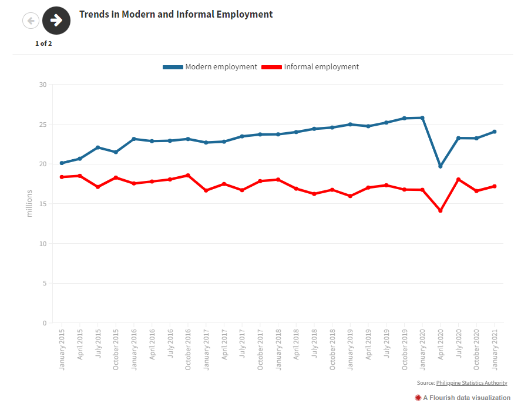
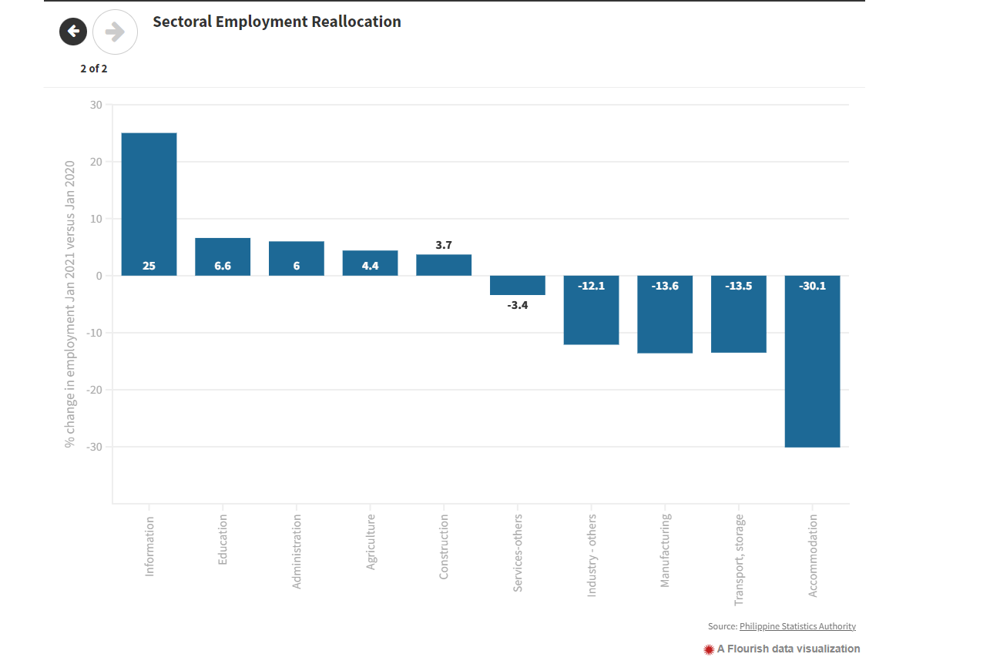
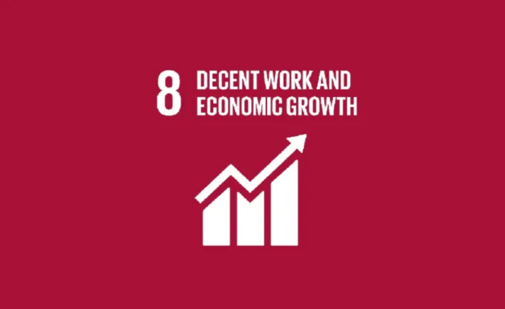

# Project Title: Employment Status of Phillipines in year of 2012 to 2019
***This repository is for our requirement in BAT404 - Analytics Techniques and Tools (IT 3206)***


## Introduction

The Philippines was going through its longest-ever economic and job expansion before the COVID-19 outbreak. With an average annual growth rate of 4.6% from 2015 to 2019, pay and salary employment (a gauge of contemporary employment) saw extraordinary development. The Philippines' overall informal employment shrank for the first time ever as a result of the rapid growth in modern employment, which was powerful enough to drive people away from it in significant numbers. Unfortunately, some of these advances were undone by the pandemic, which eliminated 1.7 million wage and salary jobs in the year leading up to January 2021. In contrast, there was an increase of around 435,000 jobs in the unorganized sector. The epidemic can have a long-term impact on employment. Simply put, even after the economy has recovered from this brief, huge shock, the employment rate may remain lower than it was before. Hysteresis in the workplace is the term for this phenomenon.

The pandemic in contemporary employment has three different lines of transmission. The number of job seekers will increase, including those who have lost their employment, school dropouts, and newcomers to the labor force. Layoff victims and newcomers to the labor force are more likely to lose their employability in the future due to lost skills the longer they are out of work. Second, the epidemic has led to a significant reorganization of positions across industries. Jobs have been lost in various industries, but those that rely on interpersonal interactions—such as lodging, food services, transportation, and leisure—have been impacted the worst. Contrarily, industries that tend to absorb smaller percentages of labor, including communications, technology, and numerous others, are those that recover rapidly and show positive employment creation.

We anticipate that this change in the employment mix will last in the medium to long term, even though some of these positions will return when the economy recovers. Due to the disparities in knowledge and expertise that different industries demand, people do not move between them. As a result, the labor market will see a rise in skill mismatches.
Third, as company models change to rely more on technology, so do workforces and the kinds of skills that employers are looking for. Jobs, workplaces, workflows, and skill requirements will all change as a result of digital transformation and remote working, including the skills needed for greater value-added services. These will make the labor market's skills gap even worse.




The Sustainable Development Goal (SDG) 8's focus on encouraging equitable and sustainable economic growth, productive employment, and decent work for all is closely matched with the project's theme and goals. We contribute to a deeper understanding of the particular goals listed in SDG 8 by investigating the employment situation in the Philippines during the coronavirus outbreak. This entails looking at movements in employment rates, job losses, and industry changes in order to shed light on the pandemic's effects on the labor market and advance the objective of generating chances for respectable employment. For policymakers, government representatives, and stakeholders involved in developing plans for economic recovery, the project's results and analyses are essential. We want to support the development of policies and activities that are in line with SDG 8, which promotes sustainable and inclusive economic growth, by identifying trends, patterns, and successful interventions. The name of our initiative acts as a link between the employment situation in the Philippines during the time of the epidemic and the larger international commitment to SDG 8, enabling a greater comprehension of the potential and challenges of establishing sustainable and productive work for all.
To sum up, SDG 8's goal of encouraging equitable and sustainable economic growth, productive employment, and decent labor is furthered by our project's research of the employment situation in the Philippines during the Coronavirus epidemic. Policymakers and stakeholders are helped by the knowledge acquired by looking at changes in employment rates, job losses, and industry movements as they formulate policies for economic recovery. We hope to promote a greater awareness of the potential and obstacles in generating sustainable and productive employment for everybody in the Philippines by integrating our initiative with SDG 8.



## Statement of the Problem
One of the most serious work problems since the Great Depression has been brought on by the COVID-19 pandemic. There is a genuine risk that the crisis will worsen inequality and poverty, with the effects lasting for years. Currently, nations must make every effort to prevent this job crisis from developing into a social disaster. It is crucial to make an investment in the future and in future generations by rebuilding a better and more resilient labor market.

In the Philippines, COVID-19 instances initially emerged gradually. On January 30, 2020, the first verified case was recorded, and on February 2, the first fatality. On March 7, local broadcasting was declared. 217,396 confirmed cases, 157,403 recoveries, and 3,520 fatalities were recorded by August 30. The capital's metropolis of Manila had the most cases.

Lockdown measures were put in place as the pandemic spread faster. The World Health Organization classified COVID-19 as a global epidemic on March 11. Beginning on March 15, Metro Manila was placed under a stringent community quarantine that forbade mass meetings, travel, and the opening of schools. The largest island region, Luzon, was placed under Enhanced Community Quarantine for a period of six months.

Only one individual per family was permitted to leave the house for necessities during the Enhanced Community Quarantine. Only enterprises in vital industries were permitted to continue, while all others were required to implement work-from-home policies. Many workers' lives were disturbed by strict lockdown procedures. Various government agencies undertook financial aid programs, supported vital industries, and hoarding prevention measures between March 12 and April 15.

The "Bayanihan to Heal as One Act," which gave the president emergency powers to deal with the COVID-19 situation, was signed by the president on March 24. The Enhanced Community Quarantine was extended to include all of Luzon through April 30. Additional actions were taken to assist the impacted enterprises, to put out aid proposals, and to create strategies for academic and vocational training.

In April, it was announced that both the General Community Quarantine and the Enhanced Community Quarantine will be extended. Under the General Community Quarantine, a few places of business, like gyms and places of amusement, remained shut. From May 16 to May 31, Metro Manila, Laguna, and Cebu City were subject to a modified enhanced community quarantine, allowing for some movement and a gradual reopening of the economy.

In Metro Manila and several provinces, the country underwent a change from Modified Enhanced Community Quarantine to General Community Quarantine, while the remainder of the nation was placed under Modified General Community Quarantine. Depending on the severity of the COVID-19 infection in each place, the length and strictness of the community quarantine varied.

## Method
In accordance with our methodology, data are gathered from a variety of trustworthy sources, including official statistics, polls, and government publications. We will investigate the pandemic's effects on the nation's labor market, including adjustments to employment rates, job losses, and changes to the sorts of industries impacted. Furthermore, we will investigate the efficacy of governmental initiatives and regulations designed to lessen the pandemic's economic effects on employment. In order to better understand the impact of the pandemic on the labor market and inform future strategies for economic recovery, we aim to offer insightful information about the employment situation in the Philippines during this difficult time through a thorough analysis of the data.

## Expected Output
In order to find noteworthy trends and patterns in the data, the project's goal is to study the job situation in the Philippines during the difficult time of the coronavirus epidemic. The researcher can get insights and develop accurate observations without making any assumptions by doing a comprehensive investigation. If the study indicates deteriorating conditions and establishes a clear link between the variables, it may be used as a foundation for increasing awareness of and addressing the causes of the employment issues. Further study and the creation of successful strategic strategies can both benefit from the results. The government may take a page from other nations' successful strategies and modify them to address the job crisis in the midst of the pandemic. Additionally, it is essential to raise awareness, especially among the younger generation, by launching advocacy campaigns and putting in place initiatives that proactively address the detrimental consequences of the coronavirus pandemic on the labor market.


# Code Instruction
## Requirements

Python installed (recommended=3.10.7). Get python [here](https://www.python.org/downloads/).

## Download source code


git clone https://github.com/KuyaGit/dataanalyticsfinals.git

### Create virtual environment

Use python virtualenv library


Install virtualenv library
Command:
pip install virtualenv

Go to your project directory and create virtual environment.
Command:
pip -m venv env

Activate virtualenv:
Command (git bash):
source env/Scripts/activate

Command (windows cmd):
env\Scripts\activate


#### Why do we use virtual environment in Python?

Using virtual environment allows you to avoid installing Python packages globally which could break system tools or other projects.

## Install libraries


Make sure you activated your virtual environment.

Command:
```
pip install -r requirements.txt
```
