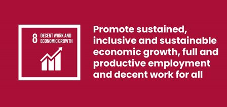

# Project Title: Employment Status of Phillipines in times of Coronavirus Pandemic
***This repository is for our requirement in BAT404 - Analytics Techniques and Tools (IT 3206)***

## Introduction

The Philippines was going through its longest-ever economic and job expansion before the COVID-19 outbreak. With an average annual growth rate of 4.6% from 2015 to 2019, pay and salary employment (a gauge of contemporary employment) saw extraordinary development. The Philippines' overall informal employment shrank for the first time ever as a result of the rapid growth in modern employment, which was powerful enough to drive people away from it in significant numbers. Unfortunately, some of these advances were undone by the pandemic, which eliminated 1.7 million wage and salary jobs in the year leading up to January 2021. In contrast, there was an increase of around 435,000 jobs in the unorganized sector. The epidemic can have a long-term impact on employment. Simply put, even after the economy has recovered from this brief, huge shock, the employment rate may remain lower than it was before. Hysteresis in the workplace is the term for this phenomenon.

The pandemic in contemporary employment has three different lines of transmission. The number of job seekers will increase, including those who have lost their employment, school dropouts, and newcomers to the labor force. Layoff victims and newcomers to the labor force are more likely to lose their employability in the future due to lost skills the longer they are out of work. Second, the epidemic has led to a significant reorganization of positions across industries. Jobs have been lost in various industries, but those that rely on interpersonal interactions—such as lodging, food services, transportation, and leisure—have been impacted the worst. Contrarily, industries that tend to absorb smaller percentages of labor, including communications, technology, and numerous others, are those that recover rapidly and show positive employment creation.

We anticipate that this change in the employment mix will last in the medium to long term, even though some of these positions will return when the economy recovers. Due to the disparities in knowledge and expertise that different industries demand, people do not move between them. As a result, the labor market will see a rise in skill mismatches.
Third, as company models change to rely more on technology, so do workforces and the kinds of skills that employers are looking for. Jobs, workplaces, workflows, and skill requirements will all change as a result of digital transformation and remote working, including the skills needed for greater value-added services. These will make the labor market's skills gap even worse.

The Sustainable Development Goal (SDG) 8's focus on encouraging equitable and sustainable economic growth, productive employment, and decent work for all is closely matched with the project's theme and goals. We contribute to a deeper understanding of the particular goals listed in SDG 8 by investigating the employment situation in the Philippines during the coronavirus outbreak. This entails looking at movements in employment rates, job losses, and industry changes in order to shed light on the pandemic's effects on the labor market and advance the objective of generating chances for respectable employment. For policymakers, government representatives, and stakeholders involved in developing plans for economic recovery, the project's results and analyses are essential. We want to support the development of policies and activities that are in line with SDG 8, which promotes sustainable and inclusive economic growth, by identifying trends, patterns, and successful interventions. The name of our initiative acts as a link between the employment situation in the Philippines during the time of the epidemic and the larger international commitment to SDG 8, enabling a greater comprehension of the potential and challenges of establishing sustainable and productive work for all.
To sum up, SDG 8's goal of encouraging equitable and sustainable economic growth, productive employment, and decent labor is furthered by our project's research of the employment situation in the Philippines during the Coronavirus epidemic. Policymakers and stakeholders are helped by the knowledge acquired by looking at changes in employment rates, job losses, and industry movements as they formulate policies for economic recovery. We hope to promote a greater awareness of the potential and obstacles in generating sustainable and productive employment for everybody in the Philippines by integrating our initiative with SDG 8.
